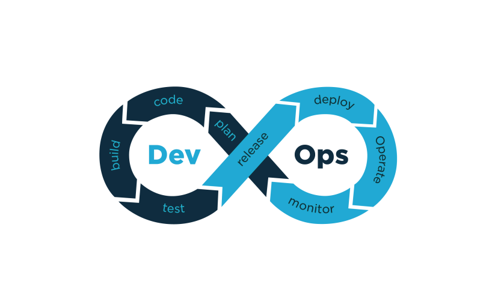

<!DOCTYPE html>
<html class="html" lang="en-US" prefix="og: https://ogp.me/ns#">

<!-- Mirrored from softechcomputers.org.in/ by HTTrack Website Copier/3.x [XR&CO'2014], Wed, 09 Jun 2021 12:47:14 GMT -->
<!-- Added by HTTrack --><meta http-equiv="content-type" content="text/html;charset=UTF-8" /><!-- /Added by HTTrack -->
<head>
	<meta name="google-site-verification" content="Ohc0_cRj-MW_w-t3VbFltH0MQ3WOnQpOdAYZE7zSSuY" />
	<meta charset="UTF-8">
	<link rel="profile" href="xfn/11.html">

	<meta name="viewport" content="width=device-width, initial-scale=1">
<!-- Search Engine Optimization by Rank Math - https://s.rankmath.com/home -->
<title>Home Page - Softech Computers</title>
<meta name="description" content="Learn how to gain or improve your skills at any time in your career.We offer you everything that you need to acquire today&#039;s skills. We provide you a broad"/>
<meta name="robots" content="index, follow, max-snippet:-1, max-video-preview:-1, max-image-preview:large"/>
<link rel="canonical" href="index-2.html" />
<meta property="og:locale" content="en_US">
<meta property="og:type" content="website">
<meta property="og:title" content="Home Page - Softech Computers">
<meta property="og:description" content="Learn how to gain or improve your skills at any time in your career.We offer you everything that you need to acquire today&#039;s skills. We provide you a broad">
<meta property="og:url" content="index-2.html">
<meta property="og:site_name" content="Softech Computers">
<meta property="og:updated_time" content="2021-05-18T10:57:56+00:00">
<meta name="twitter:card" content="summary_large_image">
<meta name="twitter:title" content="Home Page - Softech Computers">
<meta name="twitter:description" content="Learn how to gain or improve your skills at any time in your career.We offer you everything that you need to acquire today&#039;s skills. We provide you a broad">

<!-- /Rank Math WordPress SEO plugin -->

<link rel='dns-prefetch' href='index-3.html' />
<link rel="alternate" type="application/rss+xml" title="Softech Computers &raquo; Feed" href="feed/index.html" />
<link rel="alternate" type="application/rss+xml" title="Softech Computers &raquo; Comments Feed" href="comments/feed/index.html" />
		
		
	<link rel='stylesheet' id='elementor-frontend-legacy-css'  href='wp-content/plugins/elementor/assets/css/frontend-legacy.minee9a.css?ver=3.2.2' type='text/css' media='all' />
<link rel='stylesheet' id='elementor-frontend-css'  href='wp-content/plugins/elementor/assets/css/frontend.minee9a.css?ver=3.2.2' type='text/css' media='all' />
<link rel='stylesheet' id='elementor-post-176-css'  href='wp-content/uploads/elementor/css/post-1769d71.css?ver=1619880263' type='text/css' media='all' />
<link rel='stylesheet' id='elementor-post-651-css'  href='wp-content/uploads/elementor/css/post-6519d71.css?ver=1619880263' type='text/css' media='all' />
<link rel='stylesheet' id='wp-block-library-css'  href='wp-includes/css/dist/block-library/style.min9f31.css?ver=5.7.2' type='text/css' media='all' />
<link rel='stylesheet' id='wp-block-library-theme-css'  href='wp-includes/css/dist/block-library/theme.min9f31.css?ver=5.7.2' type='text/css' media='all' />
<link rel='stylesheet' id='theme-my-login-css'  href='wp-content/plugins/theme-my-login/assets/styles/theme-my-login.min03db.css?ver=7.1.1' type='text/css' media='all' />
<link rel='stylesheet' id='font-awesome-css'  href='wp-content/themes/oceanwp/assets/fonts/fontawesome/css/all.minaec5.css?ver=5.11.2' type='text/css' media='all' />
<link rel='stylesheet' id='simple-line-icons-css'  href='wp-content/themes/oceanwp/assets/css/third/simple-line-icons.min8d5a.css?ver=2.4.0' type='text/css' media='all' />
<link rel='stylesheet' id='magnific-popup-css'  href='wp-content/themes/oceanwp/assets/css/third/magnific-popup.min8a54.css?ver=1.0.0' type='text/css' media='all' />
<link rel='stylesheet' id='slick-css'  href='wp-content/themes/oceanwp/assets/css/third/slick.minaff7.css?ver=1.6.0' type='text/css' media='all' />
<link rel='stylesheet' id='oceanwp-style-css'  href='wp-content/themes/oceanwp/assets/css/style.min2e49.css?ver=1.8.7' type='text/css' media='all' />
<link rel='stylesheet' id='elementor-icons-ekiticons-css'  href='wp-content/plugins/elementskit-lite/modules/controls/assets/css/ekiticonsad76.css?ver=5.9.0' type='text/css' media='all' />
<link rel='stylesheet' id='joinchat-css'  href='wp-content/plugins/creame-whatsapp-me/public/css/joinchat.min3653.css?ver=4.1.12' type='text/css' media='all' />

<link rel='stylesheet' id='elementor-icons-css'  href='wp-content/plugins/elementor/assets/lib/eicons/css/elementor-icons.min21f9.css?ver=5.11.0' type='text/css' media='all' />
<link rel='stylesheet' id='elementor-animations-css'  href='wp-content/plugins/elementor/assets/lib/animations/animations.minee9a.css?ver=3.2.2' type='text/css' media='all' />
<link rel='stylesheet' id='elementor-post-5-css'  href='wp-content/uploads/elementor/css/post-5f763.css?ver=1619880405' type='text/css' media='all' />
<link rel='stylesheet' id='eihe-front-style-css'  href='wp-content/plugins/image-hover-effects-addon-for-elementor/assets/style.minc412.css?ver=1.3.4' type='text/css' media='all' />
<link rel='stylesheet' id='elementskit-css-widgetarea-control-editor-css'  href='wp-content/plugins/elementskit-lite/modules/controls/assets/css/widgetarea-editor605a.css?ver=2.2.2' type='text/css' media='all' />
<link rel='stylesheet' id='elementor-global-css'  href='wp-content/uploads/elementor/css/globalc49f.css?ver=1619880406' type='text/css' media='all' />
<link rel='stylesheet' id='elementor-post-6-css'  href='wp-content/uploads/elementor/css/post-60c54.css?ver=1621343089' type='text/css' media='all' />
<link rel='stylesheet' id='ekit-widget-styles-css'  href='wp-content/plugins/elementskit-lite/widgets/init/assets/css/widget-styles605a.css?ver=2.2.2' type='text/css' media='all' />
<link rel='stylesheet' id='ekit-responsive-css'  href='wp-content/plugins/elementskit-lite/widgets/init/assets/css/responsive605a.css?ver=2.2.2' type='text/css' media='all' />
<link rel='stylesheet' id='um_fonticons_ii-css'  href='wp-content/plugins/ultimate-member/assets/css/um-fonticons-ii7e68.css?ver=2.1.12' type='text/css' media='all' />
<link rel='stylesheet' id='um_fonticons_fa-css'  href='wp-content/plugins/ultimate-member/assets/css/um-fonticons-fa7e68.css?ver=2.1.12' type='text/css' media='all' />
<link rel='stylesheet' id='select2-css'  href='wp-content/plugins/ultimate-member/assets/css/select2/select2.min7e68.css?ver=2.1.12' type='text/css' media='all' />
<link rel='stylesheet' id='um_crop-css'  href='wp-content/plugins/ultimate-member/assets/css/um-crop7e68.css?ver=2.1.12' type='text/css' media='all' />
<link rel='stylesheet' id='um_modal-css'  href='wp-content/plugins/ultimate-member/assets/css/um-modal7e68.css?ver=2.1.12' type='text/css' media='all' />
<link rel='stylesheet' id='um_styles-css'  href='wp-content/plugins/ultimate-member/assets/css/um-styles7e68.css?ver=2.1.12' type='text/css' media='all' />
<link rel='stylesheet' id='um_profile-css'  href='wp-content/plugins/ultimate-member/assets/css/um-profile7e68.css?ver=2.1.12' type='text/css' media='all' />
<link rel='stylesheet' id='um_account-css'  href='wp-content/plugins/ultimate-member/assets/css/um-account7e68.css?ver=2.1.12' type='text/css' media='all' />
<link rel='stylesheet' id='um_misc-css'  href='wp-content/plugins/ultimate-member/assets/css/um-misc7e68.css?ver=2.1.12' type='text/css' media='all' />
<link rel='stylesheet' id='um_fileupload-css'  href='wp-content/plugins/ultimate-member/assets/css/um-fileupload7e68.css?ver=2.1.12' type='text/css' media='all' />
<link rel='stylesheet' id='um_datetime-css'  href='wp-content/plugins/ultimate-member/assets/css/pickadate/default7e68.css?ver=2.1.12' type='text/css' media='all' />
<link rel='stylesheet' id='um_datetime_date-css'  href='wp-content/plugins/ultimate-member/assets/css/pickadate/default.date7e68.css?ver=2.1.12' type='text/css' media='all' />
<link rel='stylesheet' id='um_datetime_time-css'  href='wp-content/plugins/ultimate-member/assets/css/pickadate/default.time7e68.css?ver=2.1.12' type='text/css' media='all' />
<link rel='stylesheet' id='um_raty-css'  href='wp-content/plugins/ultimate-member/assets/css/um-raty7e68.css?ver=2.1.12' type='text/css' media='all' />
<link rel='stylesheet' id='um_scrollbar-css'  href='wp-content/plugins/ultimate-member/assets/css/simplebar7e68.css?ver=2.1.12' type='text/css' media='all' />
<link rel='stylesheet' id='um_tipsy-css'  href='wp-content/plugins/ultimate-member/assets/css/um-tipsy7e68.css?ver=2.1.12' type='text/css' media='all' />
<link rel='stylesheet' id='um_responsive-css'  href='wp-content/plugins/ultimate-member/assets/css/um-responsive7e68.css?ver=2.1.12' type='text/css' media='all' />
<link rel='stylesheet' id='um_default_css-css'  href='wp-content/plugins/ultimate-member/assets/css/um-old-default7e68.css?ver=2.1.12' type='text/css' media='all' />
<link rel='stylesheet' id='oe-widgets-style-css'  href='wp-content/plugins/ocean-extra/assets/css/widgets9f31.css?ver=5.7.2' type='text/css' media='all' />
<link rel='stylesheet' id='google-fonts-1-css'  href='css48a6.css?family=Lato%3A100%2C100italic%2C200%2C200italic%2C300%2C300italic%2C400%2C400italic%2C500%2C500italic%2C600%2C600italic%2C700%2C700italic%2C800%2C800italic%2C900%2C900italic%7CPoppins%3A100%2C100italic%2C200%2C200italic%2C300%2C300italic%2C400%2C400italic%2C500%2C500italic%2C600%2C600italic%2C700%2C700italic%2C800%2C800italic%2C900%2C900italic%7CRoboto%3A100%2C100italic%2C200%2C200italic%2C300%2C300italic%2C400%2C400italic%2C500%2C500italic%2C600%2C600italic%2C700%2C700italic%2C800%2C800italic%2C900%2C900italic%7CRoboto+Slab%3A100%2C100italic%2C200%2C200italic%2C300%2C300italic%2C400%2C400italic%2C500%2C500italic%2C600%2C600italic%2C700%2C700italic%2C800%2C800italic%2C900%2C900italic%7CDM+Serif+Display%3A100%2C100italic%2C200%2C200italic%2C300%2C300italic%2C400%2C400italic%2C500%2C500italic%2C600%2C600italic%2C700%2C700italic%2C800%2C800italic%2C900%2C900italic&amp;display=auto&amp;ver=5.7.2' type='text/css' media='all' />
<link rel='stylesheet' id='elementor-icons-shared-0-css'  href='wp-content/plugins/elementor/assets/lib/font-awesome/css/fontawesome.min9e0b.css?ver=5.15.1' type='text/css' media='all' />
<link rel='stylesheet' id='elementor-icons-fa-solid-css'  href='wp-content/plugins/elementor/assets/lib/font-awesome/css/solid.min9e0b.css?ver=5.15.1' type='text/css' media='all' />
<link rel='stylesheet' id='elementor-icons-fa-brands-css'  href='wp-content/plugins/elementor/assets/lib/font-awesome/css/brands.min9e0b.css?ver=5.15.1' type='text/css' media='all' />
<link rel='stylesheet' id='elementor-icons-fa-regular-css'  href='wp-content/plugins/elementor/assets/lib/font-awesome/css/regular.min9e0b.css?ver=5.15.1' type='text/css' media='all' /><link rel="stylesheet" type="text/css" href="wp-content/plugins/smart-slider-3/Public/SmartSlider3/Application/Frontend/Assets/dist/smartslider.min33f7.css?ver=ff7f6f5b" media="all" />

<link rel="https://api.w.org/" href="wp-json/index.html" /><link rel="alternate" type="application/json" href="wp-json/wp/v2/pages/6.json" /><link rel="EditURI" type="application/rsd+xml" title="RSD" href="xmlrpc0db0.php?rsd" />
<link rel="wlwmanifest" type="application/wlwmanifest+xml" href="wp-includes/wlwmanifest.xml" /> 
<meta name="generator" content="WordPress 5.7.2" />
<link rel='shortlink' href='index-2.html' />
<link rel="alternate" type="application/json+oembed" href="wp-json/oembed/1.0/embed9b8a.json?url=https%3A%2F%2Fsoftechcomputers.org.in%2F" />
<link rel="alternate" type="text/xml+oembed" href="wp-json/oembed/1.0/embedee84?url=https%3A%2F%2Fsoftechcomputers.org.in%2F&amp;format=xml" />
		
	<link rel="icon" href="wp-content/uploads/2020/11/cropped-site_icon-32x32.png" sizes="32x32" />
<link rel="icon" href="wp-content/uploads/2020/11/cropped-site_icon-192x192.png" sizes="192x192" />
<link rel="apple-touch-icon" href="wp-content/uploads/2020/11/cropped-site_icon-180x180.png" />
<meta name="msapplication-TileImage" content="https://softechcomputers.org.in/wp-content/uploads/2020/11/cropped-site_icon-270x270.png" />
<!-- OceanWP CSS -->

</head>
	
<body class="home page-template page-template-elementor_header_footer page page-id-6 wp-custom-logo wp-embed-responsive oceanwp-theme sidebar-mobile has-transparent-header content-full-width content-max-width page-header-disabled has-blog-grid has-fixed-footer no-margins elementor-default elementor-template-full-width elementor-kit-5 elementor-page elementor-page-6" itemscope="itemscope" itemtype="https://schema.org/WebPage">

	
	
	

		<a class="skip-link screen-reader-text" href="#main">Skip to content</a>

		
		

			
			
		

						

							

							<section class="elementor-section elementor-top-section elementor-element elementor-element-79a6aa4 elementor-hidden-phone elementor-section-boxed elementor-section-height-default elementor-section-height-default" data-id="79a6aa4" data-element_type="section" data-settings="{&quot;ekit_has_onepagescroll_dot&quot;:&quot;yes&quot;}">
						

							

					

			

							

								

					

		

				

			

							

						

				

					<ul class="elementor-icon-list-items">
							<li class="elementor-icon-list-item">
											
							<i aria-hidden="true" class="icon icon-contact"></i>						
										softechsolutions1990@gmail.com
									</li>
						</ul>
				

				

						

					

		

				

			

							

						

				

					<ul class="elementor-icon-list-items">
							<li class="elementor-icon-list-item">
											
							<i aria-hidden="true" class="fas fa-phone-alt"></i>						
										+91 9866055044
									</li>
						</ul>
				

				

						

					

		

				

			

							

						

				

					

							

					<a class="elementor-icon elementor-social-icon elementor-social-icon-facebook elementor-repeater-item-fea58c2" href="https://www.facebook.com/softech1990/" target="_blank">
						Facebook
						<i class="fab fa-facebook"></i>					</a>
				

							

					<a class="elementor-icon elementor-social-icon elementor-social-icon-instagram elementor-repeater-item-ab02595" href="https://www.instagram.com/softech_1990/?hl=en" target="_blank">
						Instagram
						<i class="fab fa-instagram"></i>					</a>
				

					

				

				

						

					

		

								

					

		</section>
				<section class="elementor-section elementor-inner-section elementor-element elementor-element-300406e6 elementor-section-boxed elementor-section-height-default elementor-section-height-default" data-id="300406e6" data-element_type="section" data-settings="{&quot;background_background&quot;:&quot;classic&quot;,&quot;ekit_has_onepagescroll_dot&quot;:&quot;yes&quot;}">
						

							

					

			

							

						

				

								

													
														

						

				

						

					

		

				

			

							

						

				

			
            <button class="elementskit-menu-hamburger elementskit-menu-toggler">
                                    
                            </button>
            
<ul id="main-menu" class="elementskit-navbar-nav elementskit-menu-po-right submenu-click-on-icon"><li id="menu-item-225" class="menu-item menu-item-type-post_type menu-item-object-page menu-item-home current-menu-item page_item page-item-6 current_page_item menu-item-225 nav-item elementskit-mobile-builder-content active" data-vertical-menu=750px><a href="index-2.html" class="ekit-menu-nav-link active">Home</a></li>
<li id="menu-item-849" class="menu-item menu-item-type-custom menu-item-object-custom menu-item-has-children menu-item-849 nav-item elementskit-dropdown-has relative_position elementskit-dropdown-menu-default_width elementskit-mobile-builder-content" data-vertical-menu=750px><a href="#" class="ekit-menu-nav-link ekit-menu-dropdown-toggle">About Us<i class="icon icon-down-arrow1 elementskit-submenu-indicator"></i></a>
<ul class="elementskit-dropdown elementskit-submenu-panel">
	<li id="menu-item-791" class="menu-item menu-item-type-custom menu-item-object-custom menu-item-791 nav-item elementskit-mobile-builder-content" data-vertical-menu=750px><a href="about-us/index.html" class=" dropdown-item">Our Motto</a>	<li id="menu-item-793" class="menu-item menu-item-type-custom menu-item-object-custom menu-item-793 nav-item elementskit-mobile-builder-content" data-vertical-menu=750px><a href="#visionmission" class=" dropdown-item">Vision &#038; Mission</a>	<li id="menu-item-852" class="menu-item menu-item-type-custom menu-item-object-custom menu-item-852 nav-item elementskit-mobile-builder-content" data-vertical-menu=750px><a href="#ourstory" class=" dropdown-item">Our Story</a>	<li id="menu-item-853" class="menu-item menu-item-type-custom menu-item-object-custom menu-item-853 nav-item elementskit-mobile-builder-content" data-vertical-menu=750px><a href="#valuesoffered" class=" dropdown-item">Values Offered</a>	<li id="menu-item-794" class="menu-item menu-item-type-custom menu-item-object-custom menu-item-794 nav-item elementskit-mobile-builder-content" data-vertical-menu=750px><a href="#whysoftech" class=" dropdown-item">Why Softech?</a></ul>
</li>
<li id="menu-item-913" class="menu-item menu-item-type-custom menu-item-object-custom menu-item-has-children menu-item-913 nav-item elementskit-dropdown-has relative_position elementskit-dropdown-menu-default_width elementskit-mobile-builder-content" data-vertical-menu=750px><a href="#" class="ekit-menu-nav-link ekit-menu-dropdown-toggle">Courses Offered<i class="icon icon-down-arrow1 elementskit-submenu-indicator"></i></a>
<ul class="elementskit-dropdown elementskit-submenu-panel">
	<li id="menu-item-910" class="menu-item menu-item-type-post_type menu-item-object-page menu-item-910 nav-item elementskit-mobile-builder-content" data-vertical-menu=750px><a href="courses-offered/it-courses/index.html" class=" dropdown-item">IT Courses</a>	<li id="menu-item-909" class="menu-item menu-item-type-post_type menu-item-object-page menu-item-909 nav-item elementskit-mobile-builder-content" data-vertical-menu=750px><a href="courses-offered/computer-courses/index.html" class=" dropdown-item">Computer Courses</a>	<li id="menu-item-908" class="menu-item menu-item-type-post_type menu-item-object-page menu-item-908 nav-item elementskit-mobile-builder-content" data-vertical-menu=750px><a href="courses-offered/networking-courses/index.html" class=" dropdown-item">Networking Courses</a>	<li id="menu-item-907" class="menu-item menu-item-type-post_type menu-item-object-page menu-item-907 nav-item elementskit-mobile-builder-content" data-vertical-menu=750px><a href="courses-offered/cad-courses/index.html" class=" dropdown-item">CAD Courses</a>	<li id="menu-item-906" class="menu-item menu-item-type-post_type menu-item-object-page menu-item-906 nav-item elementskit-mobile-builder-content" data-vertical-menu=750px><a href="courses-offered/exclusive-individual-courses/index.html" class=" dropdown-item">Exclusive Courses</a>	<li id="menu-item-1110" class="menu-item menu-item-type-post_type menu-item-object-page menu-item-1110 nav-item elementskit-mobile-builder-content" data-vertical-menu=750px><a href="courses-offered/multimedia-courses/index.html" class=" dropdown-item">Multimedia Courses</a></ul>
</li>
<li id="menu-item-1366" class="menu-item menu-item-type-custom menu-item-object-custom menu-item-1366 nav-item elementskit-mobile-builder-content" data-vertical-menu=750px><a href="http://enroll.softechcomputers.in/" class="ekit-menu-nav-link">Enroll Now</a></li>
<li id="menu-item-810" class="menu-item menu-item-type-post_type menu-item-object-page menu-item-810 nav-item elementskit-mobile-builder-content" data-vertical-menu=750px><a href="gallery/index.html" class="ekit-menu-nav-link">Gallery</a></li>
<li id="menu-item-229" class="menu-item menu-item-type-post_type menu-item-object-page menu-item-229 nav-item elementskit-mobile-builder-content" data-vertical-menu=750px><a href="get-in-touch/index.html" class="ekit-menu-nav-link">Get in touch</a></li>
</ul>
				

					

						
					

					<button class="elementskit-menu-close elementskit-menu-toggler" type="button">X</button>
				

			

		

				

						

					

		

								

					

		</section>
						

						

					

		

			
			<main id="main" class="site-main clr"  role="main">

								
		

						

							

							<section class="elementor-section elementor-top-section elementor-element elementor-element-f1c410d elementor-section-boxed elementor-section-height-default elementor-section-height-default" data-id="f1c410d" data-element_type="section" data-settings="{&quot;background_background&quot;:&quot;classic&quot;,&quot;ekit_has_onepagescroll_dot&quot;:&quot;yes&quot;}">
						

							

					

			

							

						

				

			
&nbsp;&nbsp;&nbsp;Online and offline classes have begun!&nbsp;&nbsp;&nbsp;Attend demo class for free.
&nbsp;&nbsp;&nbsp;Learn from the best to become the best!&nbsp;&nbsp;&nbsp;Softech has 3 decades of experience in training students.
&nbsp;&nbsp;&nbsp;తెలంగాణాలో కెల్లా అతి పెద్ద కంప్యూటర్ విద్యా సంస్థ!&nbsp;&nbsp;&nbsp;కంప్యూటర్ నేర్చుకోండి - మీ జీవితాన్ని మార్చుకోండి!
		

				

						

					

		

								

					

		</section>
				<section class="elementor-section elementor-top-section elementor-element elementor-element-75a0483 elementor-section-boxed elementor-section-height-default elementor-section-height-default" data-id="75a0483" data-element_type="section" data-settings="{&quot;ekit_has_onepagescroll_dot&quot;:&quot;yes&quot;}">
						

							

					

			

							

						

				

			

        

            

                                                

                    

<h2 id="n2-ss-5item1" class="n2-font-3a939ab86c69e78a40d185481c3836c8-hover   n2-ss-item-content n2-ow" style="display:block;">Experience The Joy of Learning</h2>

We provide you the extensive exposure to upgrade and update your skill set. Choose the ones that contribute to the development of your career.

<a class="n2-style-1a5b74c1a070e82bad8ed3dfd9217329-heading  n2-ow " target="_blank" href="softech-computers/index.html">

Know more

</a>

<h2 id="n2-ss-5item5" class="n2-font-3a939ab86c69e78a40d185481c3836c8-hover   n2-ss-item-content n2-ow" style="display:block;">SOFTECH - SETWIN Benefits</h2>

<a class="n2-style-1a5b74c1a070e82bad8ed3dfd9217329-heading  n2-ow " href="setwin/index.html">

Know More

</a>

<h2 id="n2-ss-5item8" class="n2-font-aad554142ab3014b5795e92cd8f45ee5-hover   n2-ss-item-content n2-ow" style="display:block;">Our Exclusive English Courses</h2>

Learning English is no more a rocket science with our specially designed English Courses for students. Practice consistently and speak confidently.

<a class="n2-style-2400835afc27eccbd619e081069cc900-heading  n2-ow " href="english-courses/index.html">

Know More

</a>

                

            

            

        

        

		

				

						

					

		

								

					

		</section>
				<section class="elementor-section elementor-top-section elementor-element elementor-element-0bf4308 elementor-section-boxed elementor-section-height-default elementor-section-height-default" data-id="0bf4308" data-element_type="section" data-settings="{&quot;ekit_has_onepagescroll_dot&quot;:&quot;yes&quot;}">
						

							

					

			

							

						

				

			<h1 class="elementor-heading-title elementor-size-default">Welcome to Softech Computers!</h1>		

				

				

				

								

					
Learn how to gain or improve your skills at any time in your career.We offer you everything that you need to acquire today&#8217;s skills. We provide you a broad range of courses on
					

						

				

				

				

								

					<ul><li>Computer Skills</li><li>Soft Skills</li><li>English Speaking Skills</li><li>Technical Skills</li><li>Industry Skills</li></ul>					

						

				

						

					

		

				

			

							

						<section class="elementor-section elementor-inner-section elementor-element elementor-element-de4c85c elementor-section-boxed elementor-section-height-default elementor-section-height-default" data-id="de4c85c" data-element_type="section" data-settings="{&quot;ekit_has_onepagescroll_dot&quot;:&quot;yes&quot;}">
						

							

					

			

							

						

				

					

						

				<a class="elementor-icon elementor-animation-" href="about-us/index.html">
				<i aria-hidden="true" class="fas fa-user"></i>				</a>
			

						

				<h3 class="elementor-icon-box-title">
					<a href="about-us/index.html">About Us</a>
				</h3>
							

		

				

				

						

					

		

				

			

							

						

				

					

						

				<a class="elementor-icon elementor-animation-" href="enroll-now/index.html">
				<i aria-hidden="true" class="far fa-list-alt"></i>				</a>
			

						

				<h3 class="elementor-icon-box-title">
					<a href="enroll-now/index.html">Enroll Now</a>
				</h3>
							

		

				

				

						

					

		

								

					

		</section>
				

				

					

			

		

				

				

				<section class="elementor-section elementor-inner-section elementor-element elementor-element-c114072 elementor-section-boxed elementor-section-height-default elementor-section-height-default" data-id="c114072" data-element_type="section" data-settings="{&quot;ekit_has_onepagescroll_dot&quot;:&quot;yes&quot;}">
						

							

					

			

							

						

				

					

						

				<a class="elementor-icon elementor-animation-" href="gallery/index.html">
				<i aria-hidden="true" class="fas fa-images"></i>				</a>
			

						

				<h3 class="elementor-icon-box-title">
					<a href="gallery/index.html">Our Gallery</a>
				</h3>
							

		

				

				

						

					

		

				

			

							

						

				

					

						

				<a class="elementor-icon elementor-animation-" href="get-in-touch/index.html">
				<i aria-hidden="true" class="fas fa-phone-alt"></i>				</a>
			

						

				<h3 class="elementor-icon-box-title">
					<a href="get-in-touch/index.html">Connect Us</a>
				</h3>
							

		

				

				

						

					

		

								

					

		</section>
						

					

		

								

					

		</section>
				<section class="elementor-section elementor-top-section elementor-element elementor-element-5349bac2 elementor-section-content-middle elementor-section-boxed elementor-section-height-default elementor-section-height-default" data-id="5349bac2" data-element_type="section" data-settings="{&quot;animation&quot;:&quot;none&quot;,&quot;background_background&quot;:&quot;classic&quot;,&quot;ekit_has_onepagescroll_dot&quot;:&quot;yes&quot;}">
							

							

							

					

			

							

						

				

			<h4 class="elementor-heading-title elementor-size-default">Trending Courses & Enrollment</h4>		

				

				<section class="elementor-section elementor-inner-section elementor-element elementor-element-ac982ac elementor-section-boxed elementor-section-height-default elementor-section-height-default" data-id="ac982ac" data-element_type="section" data-settings="{&quot;ekit_has_onepagescroll_dot&quot;:&quot;yes&quot;}">
						

							

					

			

							

						

				

								

																										

						

				

				

				

			<h2 class="elementor-heading-title elementor-size-default">Python Programming</h2>		

				

				

				

					

			<a href="http://enroll.softechcomputers.in/" class="elementor-button-link elementor-button elementor-size-sm" role="button">
						
						Enroll Now
		
					</a>
		

				

				

						

					

		

				

			

							

								

					

		

				

			

							

						

				

								

																										

						

				

				

				

			<h2 class="elementor-heading-title elementor-size-default">DevOps</h2>		

				

				

				

					

			<a href="http://enroll.softechcomputers.in/" class="elementor-button-link elementor-button elementor-size-sm" role="button">
						
						Enroll Now
		
					</a>
		

				

				

						

					

		

				

			

							

								

					

		

				

			

							

						

				

								

																										

						

				

				

				

			<h2 class="elementor-heading-title elementor-size-default">Java</h2>		

				

				

				

					

			<a href="enroll-now/index.html" class="elementor-button-link elementor-button elementor-size-sm" role="button">
						
						Enroll Now
		
					</a>
		

				

				

						

					

		

								

					

		</section>
						

					

		

								

					

		</section>
				<section class="elementor-section elementor-top-section elementor-element elementor-element-4f15e88b elementor-section-content-middle elementor-section-boxed elementor-section-height-default elementor-section-height-default" data-id="4f15e88b" data-element_type="section" data-settings="{&quot;animation&quot;:&quot;none&quot;,&quot;background_background&quot;:&quot;classic&quot;,&quot;ekit_has_onepagescroll_dot&quot;:&quot;yes&quot;}">
						

							

					

			

							

						

				

			<h4 class="elementor-heading-title elementor-size-default">Milestones</h4>		

				

				<section class="elementor-section elementor-inner-section elementor-element elementor-element-3ad2d128 elementor-section-boxed elementor-section-height-default elementor-section-height-default" data-id="3ad2d128" data-element_type="section" data-settings="{&quot;ekit_has_onepagescroll_dot&quot;:&quot;yes&quot;}">
						

							

					

			

							

						

				

					

			

				
				1
				
			

							
Students reached 

					

				

				

						

					

		

				

			

							

						

				

					

			

				
				1
				+
			

							
faculty support 

					

				

				

						

					

		

				

			

							

						

				

					

			

				
				1
				
			

							
Govt. Acknowledgements 

					

				

				

						

					

		

								

					

		</section>
						

					

		

								

					

		</section>
						

						

					

		
	</main><!-- #main -->

	
	
	
		
		

						

							

							<section class="elementor-section elementor-top-section elementor-element elementor-element-60723897 elementor-section-full_width elementor-section-height-default elementor-section-height-default" data-id="60723897" data-element_type="section" data-settings="{&quot;background_background&quot;:&quot;classic&quot;,&quot;ekit_has_onepagescroll_dot&quot;:&quot;yes&quot;}">
						

							

					

			

							

						<section class="elementor-section elementor-inner-section elementor-element elementor-element-fbd6e47 elementor-section-full_width elementor-section-height-default elementor-section-height-default" data-id="fbd6e47" data-element_type="section" data-settings="{&quot;ekit_has_onepagescroll_dot&quot;:&quot;yes&quot;}">
						

							

					

			

							

						

				

								

													
														

						

				

						

					

		

				

			

							

						

				

			<h2 class="elementor-heading-title elementor-size-default">Quick Links</h2>		

				

				

				

			
		

							

					<a  target=_blank rel=""  href="index-2.html" class="elementor-repeater-item-b8b3752 ekit_badge_left">
						

															
									<i aria-hidden="true" class="fas fa-check"></i>								
														
								Home
															
						

											</a>
				

								

					<a  target=_blank rel=""  href="about-us/index.html" class="elementor-repeater-item-db6ad13 ekit_badge_left">
						

															
									<i aria-hidden="true" class="fas fa-check"></i>								
														
								About Us
															
						

											</a>
				

								

					<a  target=_blank rel=""  href="gallery/index.html" class="elementor-repeater-item-753af99 ekit_badge_left">
						

															
									<i aria-hidden="true" class="fas fa-check"></i>								
														
								Gallery
															
						

											</a>
				

								

					<a  target=_blank rel=""  href="get-in-touch/index.html" class="elementor-repeater-item-7021517 ekit_badge_left">
						

															
									<i aria-hidden="true" class="fas fa-check"></i>								
														
								Get in Touch
															
						

											</a>
				

						

		
		

				

						

					

		

				

			

							

						

				

			<h2 class="elementor-heading-title elementor-size-default">Contact</h2>		

				

				

				

					<ul class="elementor-icon-list-items">
							<li class="elementor-icon-list-item">
											
							<i aria-hidden="true" class="fas fa-map-marker-alt"></i>						
										Branch Office 1: 3rd Floor, GMR & GS Complex,  Kishanpura, Hanumakonda, Telangana, India - 9866055044
									</li>
								<li class="elementor-icon-list-item">
											
							<i aria-hidden="true" class="fas fa-map-marker-alt"></i>						
										Branch Office 2: GMB complex, 3rd floor, above A - Z bazaar , Aadalath circle, Hanamakonda - 9246899300 / 319
									</li>
								<li class="elementor-icon-list-item">
											
							<i aria-hidden="true" class="fas fa-phone-alt"></i>						
										9866055044/33
									</li>
								<li class="elementor-icon-list-item">
											
							<i aria-hidden="true" class="far fa-envelope"></i>						
										softechsolutions1990@gmail.com
									</li>
						</ul>
				

				

						

					

		

				

			

							

						

				

								

																										

						

				

						

					

		

								

					

		</section>
				<section class="elementor-section elementor-inner-section elementor-element elementor-element-24daa155 elementor-section-boxed elementor-section-height-default elementor-section-height-default" data-id="24daa155" data-element_type="section" data-settings="{&quot;ekit_has_onepagescroll_dot&quot;:&quot;yes&quot;}">
						

							

					

			

							

						

				

			

					© CopyRights2020 Softech Computers
				

		

				

						

					

		

								

					

		</section>
						

					

		

								

					

		</section>
						

						

					

		

	
	

<!-- #wrap -->

<!-- #outer-wrap -->

<a id="scroll-top" class="scroll-top-right" href="#"></a>

	<a href="#" class="toggle-sidr-close" aria-label="Close mobile Menu">
		<i class="icon icon-close" aria-hidden="true"></i>Close Menu
	</a>

	
	

		<ul id="menu-footer-menu" class="mobile-menu dropdown-menu"><li id="menu-item-1270" class="menu-item menu-item-type-post_type menu-item-object-page menu-item-home current-menu-item page_item page-item-6 current_page_item menu-item-1270"><a href="index-2.html" aria-current="page">Home Page</a></li>
<li id="menu-item-1271" class="menu-item menu-item-type-post_type menu-item-object-page menu-item-1271"><a href="about-us/index.html">About Us</a></li>
<li id="menu-item-1272" class="menu-item menu-item-type-post_type menu-item-object-page menu-item-1272"><a href="gallery/index.html">Gallery</a></li>
<li id="menu-item-1273" class="menu-item menu-item-type-post_type menu-item-object-page menu-item-1273"><a href="get-in-touch/index.html">Get in touch</a></li>
</ul>
	

	

	<form method="get" action="https://softechcomputers.org.in/" class="mobile-searchform" role="search" aria-label="Search for:">
		<label for="ocean-mobile-search1">
			<input type="search" name="s" autocomplete="off" placeholder="Search" />
			<button type="submit" class="searchform-submit" aria-label="Submit Search">
				<i class="icon icon-magnifier" aria-hidden="true"></i>
			</button>
					</label>
			</form>

<!-- .mobile-menu-search -->

	<a href="javascript:void(0);" data-action="um_remove_modal" class="um-modal-close"
	   aria-label="Close view photo modal">
		<i class="um-faicon-times"></i>
	</a>

	

		

	

	

		

								
Open chat

							<svg class="joinchat__button__send" viewbox="0 0 400 400" stroke-linecap="round" stroke-width="33">
				<path class="joinchat_svg__plain" d="M168.83 200.504H79.218L33.04 44.284a1 1 0 0 1 1.386-1.188L365.083 199.04a1 1 0 0 1 .003 1.808L34.432 357.903a1 1 0 0 1-1.388-1.187l29.42-99.427"/>
				<path class="joinchat_svg__chat" d="M318.087 318.087c-52.982 52.982-132.708 62.922-195.725 29.82l-80.449 10.18 10.358-80.112C18.956 214.905 28.836 134.99 81.913 81.913c65.218-65.217 170.956-65.217 236.174 0 42.661 42.661 57.416 102.661 44.265 157.316"/>
			</svg>
							
1

					

			

			

									<a class="joinchat__powered" href="https://join.chat/en/powered/?site=Softech+Computers&amp;url=https%3A%2F%2Fsoftechcomputers.org.in" rel="nofollow noopener" target="_blank">
						Powered by <svg viewbox="0 0 1424 318"><title>Join.chat</title><path d="M171 7c1.3 0 3.2.6 5.5 1.8 2.3 1.1 3.5 2.3 3.5 3.4v1.2l-.3 3.6-.5 8a947.3 947.3 0 00-2 56v37.2l.2 15.9.2 23.7c.2 12.3.2 22.8.2 31.4 0 22-5.8 42.8-17.4 62.5-11.6 19.7-27.9 35.7-48.7 48S68 318 43.3 318c-14 0-24.6-2.7-32-8.2A27 27 0 010 286.6a27 27 0 017-18.7c4.7-5.2 11-7.8 18.8-7.8 6.9 0 13.1 2 18.7 6 5.4 3.8 9.7 7.9 12.8 12.4l.3.5A96.8 96.8 0 0068 291.9c3.7 4 7.2 5.9 10.3 5.9 4 0 7.1-2 9.6-6s4.5-11.8 6.2-23.3v-.6a363 363 0 002.5-47.5V104.2l.1-.1V76.3c0-1.6-.2-2.6-.6-3V73c-.5-.4-1.4-.8-3-1.2l-.5-.2-11.9-2c-1.9-.3-2.8-2.5-2.8-6.7 0-3.8 1-6 2.8-6.7 27-10.5 56.2-26.6 87.5-48.3a6 6 0 012.8-1zm1205 43c3.9 0 6 .8 6.1 2.5 1.3 9.6 2.1 21.8 2.5 36.6h.5a1888.3 1888.3 0 0033.7-.3h.8c1.7 0 2.8.7 3.4 2s1 4 1 8-.3 6.6-1 7.7c-.6 1.2-1.7 1.8-3.4 1.8h-1.9c-15.1 0-26-.2-32.8-.4v62c0 13.8 1.7 23.3 5.1 28.5 3.4 5.3 8.8 7.9 16 7.9 1.4 0 3-.3 4.6-1 1.7-.6 2.7-.9 3.1-.9 1.9 0 3.8 1 5.6 3 1.9 2 2.5 3.7 1.9 5.1a62.9 62.9 0 01-22 27.8 59.2 59.2 0 01-36.3 11.7c-16.1 0-28.4-4.9-36.9-14.6-3.3-3.8-6-8.1-8-13l-.4.4-.6.5c-17.4 17.1-33 25.7-46.7 25.7-18.7 0-31.7-13-39.2-39.2-5 12.3-12 22-21 28.9a49.2 49.2 0 01-30.7 10.3 37.6 37.6 0 01-29-12.5 44 44 0 01-11.4-30.7c0-9.5 1.6-17.2 5-23a41 41 0 0117-15.3c13.2-7 35.4-13.8 66.6-20.8l1-.2V138c0-10.8-1.7-19.3-5-25.5-3.3-6.4-7.9-9.6-13.7-9.6-2.8 0-4.4 1.6-5 4.7v.3l-2.1 14.8-.1.6a38.4 38.4 0 01-11.1 24c-6 5.4-13.5 8.1-22.4 8.1-5.2 0-9.6-1.5-13.1-4.6a16 16 0 01-5.3-12.7c0-10.7 8.8-21.7 26.3-33s37.5-17 60-17c41 0 61.7 15.2 62.1 45.7V192c0 4.6.3 8.4.7 11.4.4 3 1 5.4 1.7 7 .7 1.7 1.7 2.7 2.8 3.1 1.1.5 2.3.5 3.6 0a21 21 0 004.6-2.4l1.7-1c-.7-4-1-8.4-1-13v-85.8c0-1.5-.2-2.4-.6-2.8-.4-.5-1.4-.9-3-1.3l-11.2-1.6c-1.7-.2-2.5-2.3-2.5-6.2 0-4.4.8-6.7 2.5-7 15.9-3.7 29-8.6 39.3-14.6a144 144 0 0031-25.4c1.7-1.7 4-2.5 7.1-2.5zM290 88c27.5 0 49.7 7.2 66.6 21.6a73.1 73.1 0 0125.3 58.7c0 25.7-9 46-27 60.6S313.3 251 283.9 251c-27.5 0-49.7-7.2-66.6-21.6a73.1 73.1 0 01-25.3-58.7c0-25.7 9-46 27-60.6S260.8 88 290.1 88zm588.2 0c18.5 0 33.4 4.1 44.5 12.3 11.2 8.3 16.7 17.9 16.7 28.8 0 6.1-2.1 11.2-6.5 15.2s-9.9 6-16.7 6c-13 0-24-8.5-33-25.6-5.6-10.5-10-17.3-13-20.5s-6.1-4.8-9.7-4.8c-7.4 0-11 5.5-11 16.4 0 13.6 3 28.2 9.2 44a108 108 0 0023.2 37.5c8 8 16.5 12 25.4 12 7.6 0 15.3-3.3 23.2-9.9 1.4-1 3.5-.6 6.1 1.3 2.7 1.8 3.8 3.6 3.1 5.2a70.1 70.1 0 01-28.7 31.8 89 89 0 01-48.6 13.3 77.6 77.6 0 01-57.2-22.2 78.4 78.4 0 01-22.3-58c0-24.6 9-44.5 27-59.8 17.9-15.3 40.6-23 68.3-23zm-402.4-2.8c1.2 0 2.9.5 5 1.6 2 1 3 2 3 3.1l-.6 9.7a784.6 784.6 0 00-1.9 53.2v76.5c.1 2.2 1.3 3.6 3.5 4l.2.1 10.5 2.2.5.1h.4l10.5-2.2h.3c2.3-.5 3.4-2 3.4-4.4v-81.9c0-1.3-.2-2.1-.6-2.5-.4-.4-1.4-.8-3-1.3l-10.6-1.8h-.2c-1.5-.4-2.3-2.3-2.3-6 0-3.2.8-5.2 2.5-5.8a364 364 0 0074.3-42.9c.9-.6 1.7-.9 2.5-.9 1.3 0 3 .5 5 1.6s3 2 3 3v.1c0 .8-.1 4.9-.5 12a392.8 392.8 0 00-.7 21.8 64.5 64.5 0 0121.6-26 56.2 56.2 0 0134-10.6c16.2 0 29 4.6 38.5 14a52.6 52.6 0 0114 39v88.5c.2 2.3 1.4 3.7 3.8 4l10.5 2.3h.2c1.5.3 2.3 2.6 2.3 6.8 0 4.3-.8 6.5-2.5 6.5l-19-1c-11.7-.8-22-1.2-30.9-1.2s-18.8.4-29.9 1.1l-18 1.1c-1.7 0-2.6-2.2-2.6-6.5 0-4 .9-6.2 2.5-6.8l8.4-2.2.3-.1c1.5-.4 2.4-.8 2.8-1.3.4-.5.6-1.5.6-3v-61.9c0-14-2-24-6-29.7-4-5.8-11.2-8.7-21.6-8.7-3 0-5.3.4-6.8 1v99.6c0 1.3.2 2.2.6 2.7.4.5 1.5 1 3.1 1.4l8.4 2.1.1.1c1.6.7 2.4 3 2.4 6.8 0 4.3-.9 6.5-2.5 6.5l-18-1a454.5 454.5 0 00-60.7 0 868.8 868.8 0 01-20 1h-.2l-18.8-1c-11.6-.8-21.7-1.2-30.5-1.2s-19 .4-30.7 1.1l-19 1.1c-1.7 0-2.5-2.2-2.5-6.6 0-4.2.8-6.5 2.3-6.8h.2l10.4-2.2h.2c2.2-.5 3.4-1.9 3.5-4.1v-82.6c0-1.3-.3-2.1-.6-2.5-.4-.4-1.3-.8-2.8-1.2h-.3l-10.4-2h-.2c-1.5-.3-2.3-2.2-2.3-5.9 0-3.3.8-5.3 2.5-5.9a380 380 0 0077-43c1-.7 1.8-1 2.4-1zM1014.7 10c1.3 0 3 .5 5 1.5s3.1 2 3.1 3.1l-.6 9.5a758.2 758.2 0 00-1.9 54.5v42.7l.4-.6c5.1-8.8 12.2-16.1 21.3-22.1a56 56 0 0131.6-9.2c16.3 0 29.2 4.6 38.6 13.8a51.8 51.8 0 0114 38.8v87.6c.2 2.3 1.4 3.6 3.8 4l10.5 2.2h.2c1.5.3 2.3 2.6 2.3 6.7 0 4.3-.8 6.5-2.5 6.5l-19-1c-11.7-.8-22-1.2-30.9-1.2s-18.8.4-29.9 1.1l-18 1.1c-1.7 0-2.6-2.2-2.6-6.5 0-3.9.9-6.1 2.5-6.7l8.4-2.2h.3c1.5-.4 2.4-.9 2.8-1.4.4-.5.6-1.5.6-2.9V168c0-14-2-23.8-6-29.4-4-5.8-11.2-8.6-21.6-8.6-3 0-5.3.3-6.8.9v98.7c0 1.3.2 2.2.6 2.6.4.5 1.5 1 3.1 1.4l8.4 2.2h.1c1.6.7 2.4 3 2.4 6.7 0 4.3-.9 6.5-2.5 6.5l-18-1a459 459 0 00-60.7 0l-19.2 1c-1.7 0-2.5-2.2-2.5-6.5s.8-6.5 2.5-6.7l10.5-2.2h.3c2.3-.5 3.4-2 3.4-4.3V70.6c0-1.3-.2-2-.6-2.5-.4-.4-1.4-.8-3-1.2l-10.6-1.8h-.2c-1.5-.4-2.3-2.3-2.3-5.9 0-3.3.8-5.2 2.5-5.8 24-9.3 49.9-23.4 77.8-42.5 1-.6 1.8-.9 2.4-.9zm-743 90c-7.6 0-11.4 6.7-11.4 20.3 0 16.6 3.7 38.3 11.2 65.2 7.4 26.9 14.5 43.7 21.1 50.3 3.1 3 6.3 4.6 9.7 4.6 7.6 0 11.5-6.8 11.5-20.4 0-16.5-3.8-38.2-11.2-65.2-7.5-26.9-14.5-43.6-21.2-50.2-3.1-3.1-6.3-4.7-9.6-4.7zm939.2 64.9c-6 0-9.1 4.3-9.1 12.8 0 8.4 2.4 15.9 7 22.4 4.8 6.6 10 9.8 15.4 9.8 2.2 0 4-.6 5.4-2l.3-.1v-22.3a20.6 20.6 0 00-6.7-14.8c-4-3.9-8-5.8-12.3-5.8zM450.6 0a34 34 0 0125.5 10.3c6.7 6.9 10 15.4 10 25.7a35 35 0 01-35.5 36 34 34 0 01-25.5-10.4 35.3 35.3 0 01-10-25.6c0-10.3 3.3-18.8 10-25.7A34 34 0 01450.6 0zM748 249a31 31 0 0022-8.2c6-5.5 9-12.2 9-20.3s-3-14.8-8.9-20.3-13.2-8.2-22-8.2-16.3 2.7-22.2 8.2-8.9 12.2-8.9 20.3 3 14.8 8.9 20.3 13.3 8.2 22.1 8.2z"/></svg>
					</a>
								

			

			

				

					
Hi There,  How can I assist you?  SOFTECH COMPUTERS
				

			

		

		<svg height="0" width="0"><defs><clipPath id="joinchat__message__peak"><path d="M17 25V0C17 12.877 6.082 14.9 1.031 15.91c-1.559.31-1.179 2.272.004 2.272C9.609 18.182 17 18.088 17 25z"/></clipPath></defs></svg>

<!--[if lt IE 9]>

<![endif]-->

		
	</body>

<!-- Mirrored from softechcomputers.org.in/ by HTTrack Website Copier/3.x [XR&CO'2014], Wed, 09 Jun 2021 12:49:52 GMT -->
</html>
